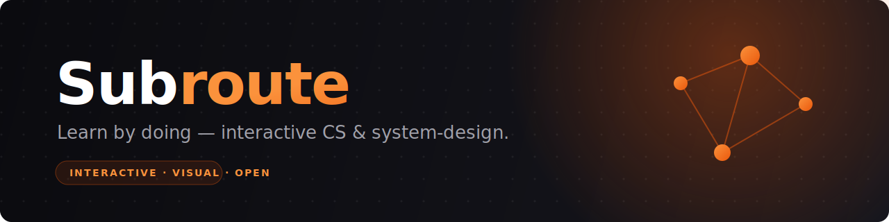

<div align="center">



# Subroute

### Learn CS & system-design concepts through interactive prototypes — not walls of text.

[](./LICENSE)
[](https://nextjs.org/)
[](https://www.typescriptlang.org/)
[](https://tailwindcss.com/)
[](./CONTRIBUTING.md)
[](https://subroute-flame.vercel.app)

[**Live Demo**](https://subroute-flame.vercel.app) · [**Quick Start**](#-quick-start) · [**Contributing**](./CONTRIBUTING.md) · [**Report Bug**](https://github.com/Yathiskumar/Subroute/issues/new?template=bug_report.md) · [**Request Feature**](https://github.com/Yathiskumar/Subroute/issues/new?template=feature_request.md)

</div>

---

## 📖 Overview

**Subroute** is a web platform where users learn technical CS and system-design concepts through **interactive prototypes and visual simulations**, rather than static text. Instead of reading about how a token-bucket rate limiter works, you *drag the sliders and watch the bucket fill and drain.*

> This repository is **Phase 1**: structure, routes, and components. Content is placeholder, with one fully working end-to-end demo wired up to prove the iframe-loading mechanism.

<div align="center">

| 🎮 Interactive | 🌗 Dark-first | ⚡ Zero-config prototypes | 🧩 Typed & modular |
|:---:|:---:|:---:|:---:|
| Learn by doing | Dark mode default | Drop in plain HTML | One-file topic additions |

</div>

---

## ✨ Features

- **Interactive prototypes** — sandboxed iframes load standalone HTML/CSS/JS simulations with no build step.
- **Topic & concept routing** — clean nested routes (`/topics/<topic>/<concept>`) generated from a single typed data file.
- **Semantic design system** — every color, surface, and accent resolves to CSS variables. No hex codes in components.
- **Search & tag filtering** — find topics by keyword or tag on the listing page.
- **Quiz scaffolding** — question containers and difficulty badges ready for real scoring logic.
- **Dark / light themes** — powered by `next-themes`, dark by default.

---

## 🚀 Quick Start

```bash
# 1. Install dependencies
pnpm install

# 2. Start the dev server
pnpm dev

# 3. Open http://localhost:3000
```

### Available scripts

| Command | Description |
| --- | --- |
| `pnpm dev` | Start the development server |
| `pnpm build` | Create a production build |
| `pnpm start` | Serve the built output |
| `pnpm typecheck` | Run `tsc --noEmit` |
| `pnpm lint` | Run `next lint` |

> 💡 One working prototype lives at `/topics/rate-limiting/token-bucket` — it loads `public/prototypes/demo/demo.html` in a sandboxed iframe. All other concept pages show a polished placeholder.

---

## 🛠️ Tech Stack

<div align="center">


</div>

- **Next.js 14** App Router · TypeScript strict
- **Tailwind CSS** with semantic CSS-variable tokens
- **Radix UI** primitives (Dialog, Collapsible, Slot) — minimal, hand-rolled
- **next-themes** for dark/light mode
- **Framer Motion** & **lucide-react** — installed and ready
- **@next/mdx** & **shiki** — installed, reserved for the content phase
- **pnpm** as the package manager

---

## 📂 Project Structure

```
app/
  layout.tsx                 Root layout + fonts + Providers
  page.tsx                   Homepage
  not-found.tsx              404 page
  topics/
    page.tsx                 Topic listing (search + tag filter)
    [topicSlug]/
      page.tsx               Topic detail (concept list + sidebar TOC)
      [conceptSlug]/page.tsx Concept detail — the main learning surface
  about/page.tsx
  playground/page.tsx
  providers.tsx              ThemeProvider wrapper

components/
  ui/            Base primitives (button, card, badge, input, …)
  layout/        Navbar, Footer, MobileMenu, ThemeToggle, Logo
  cards/         TopicCard, ConceptCard
  prototype/     PrototypeFrame (iframe + toolbar)
  quiz/          QuizContainer, QuizQuestion
  shared/        Breadcrumb, Callout, CodeBlock, ConceptNav, …

lib/
  data/topics.ts    All placeholder topic + concept data (typed)
  data/quiz.ts       Sample quiz data
  types/index.ts     Topic, Concept, Difficulty, QuizItem types
  utils/             cn.ts, slug.ts helpers

public/prototypes/demo/demo.html   The working token-bucket demo
styles/globals.css                  Theme tokens (CSS vars) + base styles
```

---

## 🎨 Design System

All colors, borders, and accents are CSS variables. Semantic Tailwind tokens are exposed in `tailwind.config.ts`:

| Token | Purpose |
| --- | --- |
| `bg-background` | Page background |
| `bg-surface` | Subtle elevation |
| `bg-surface-elevated` | Card / panel surfaces |
| `bg-surface-sunken` | Recessed areas (code, console) |
| `border-border` | Default border |
| `border-border-subtle` | Quiet divider |
| `border-border-strong` | Stronger border on hover / focus |
| `text-foreground` | Primary text |
| `text-muted` | Secondary text |
| `text-subtle` | Tertiary / labels |
| `text-accent` | Signal accent (warm orange) |
| `text-diff-*` | Difficulty (`beginner`, `intermediate`, `advanced`) |

Two utility classes worth knowing:

- `.kicker` — mono uppercase mini-label used above headings.
- `.bg-grid-fade` / `.bg-dot-grid` — decorative backgrounds masked to fade out.

---

## ➕ Adding Content

<details>
<summary><strong>How to add a new topic</strong></summary>

<br>

Topics live in **`lib/data/topics.ts`** as a typed array. Adding one is a single-file change — the rest of the app picks it up automatically.

```ts
// lib/data/topics.ts
export const TOPICS: Topic[] = [
  // …existing topics
  {
    slug: "circuit-breakers",
    title: "Circuit Breakers",
    description: "Stop calling a failing service before it takes you down with it.",
    difficulty: "intermediate",
    icon: "Zap",                       // any lucide-react icon name
    tags: ["distributed", "resilience"],
    estimatedTime: "40 min",
    prerequisites: ["Retries & timeouts"],
    concepts: [
      {
        slug: "closed-open-half-open",
        title: "Closed / Open / Half-Open",
        oneLiner: "The three states every circuit breaker cycles through.",
        difficulty: "intermediate",
        estimatedTime: "8 min",
        prototypePath: null,           // or "/prototypes/circuit-breakers/states.html"
      },
    ],
  },
];
```

The topic appears on the homepage grid, on `/topics`, at `/topics/circuit-breakers`, and each concept at `/topics/circuit-breakers/<conceptSlug>`.

</details>

<details>
<summary><strong>How to add a new prototype</strong></summary>

<br>

1. Drop a standalone HTML file under `public/prototypes/<topic-slug>/<concept-slug>.html`. It can use any vanilla HTML/CSS/JS — no build step.
2. Set `prototypePath` on the matching concept in `lib/data/topics.ts` to `"/prototypes/<topic-slug>/<concept-slug>.html"`.

The iframe is sandboxed with `allow-scripts` and loads lazily. See `public/prototypes/demo/demo.html` for a working reference.

</details>

<details>
<summary><strong>How to swap in real content</strong></summary>

<br>

Phase 1 deliberately ships **no MDX wiring**. The dependencies (`@next/mdx`, `shiki`) are installed and ready; the explanation area in `app/topics/[topicSlug]/[conceptSlug]/page.tsx` is where MDX-rendered content will plug in. Replace the placeholder `<article>` body with `<Mdx source={...} />` once the content pipeline is built.

</details>

---

## 🗺️ Roadmap

- [x] **Phase 1** — Scaffold: structure, routes, components, one working demo
- [ ] **Phase 2** — MDX content pipeline (`@next/mdx` + `shiki`)
- [ ] **Phase 3** — Real interactive prototypes across topics
- [ ] **Phase 4** — Quiz scoring logic
- [ ] **Phase 5** — Auth, accounts, progress persistence
- [ ] **Phase 6** — Analytics & SEO

> **Out of scope for Phase 1:** real content, prototypes beyond the demo, authentication, backend/database, real quiz scoring, MDX rendering, and analytics.

---

## 🤝 Contributing

Contributions are what make the open-source community such an amazing place to learn and build. Any contributions you make are **greatly appreciated**.

Please read our [**Contributing Guide**](./CONTRIBUTING.md) and [**Code of Conduct**](./CODE_OF_CONDUCT.md) before getting started.

1. Fork the project
2. Create your feature branch (`git checkout -b feature/amazing-feature`)
3. Commit your changes (`git commit -m 'Add some amazing feature'`)
4. Push to the branch (`git push origin feature/amazing-feature`)
5. Open a Pull Request

---

## 📜 License

Distributed under the **MIT License**. See [`LICENSE`](./LICENSE) for more information.

---

<div align="center">

Built with ❤️ by [Yathiskumar](https://github.com/Yathiskumar) and [contributors](https://github.com/Yathiskumar/Subroute/graphs/contributors).

If you find this project useful, consider giving it a ⭐️

</div>
